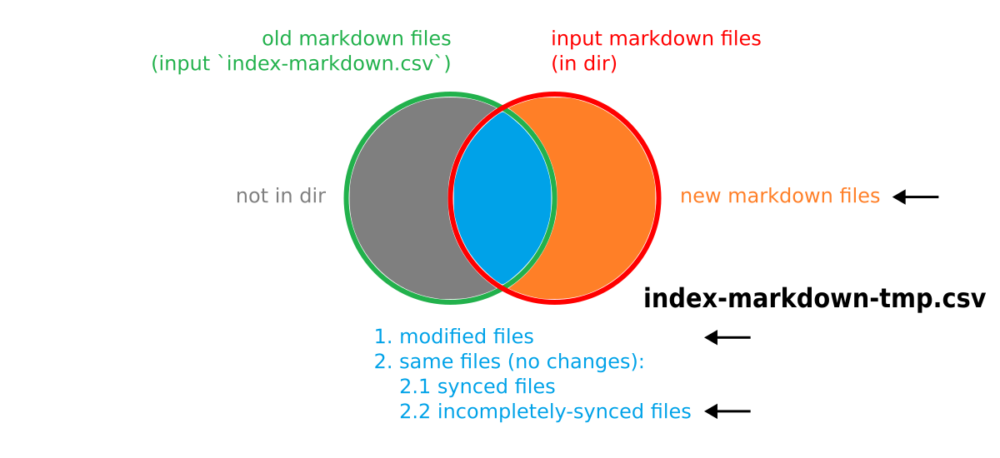
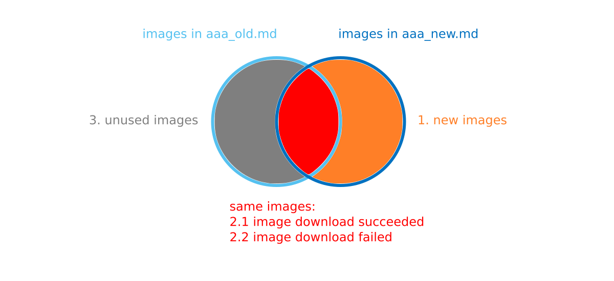
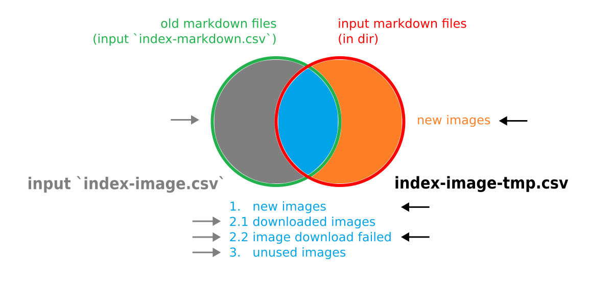

# Sync Markdown

Download Imgur images in markdown and replace those URLs with local paths.


User scenarios: 
-   sync local markdown files after you manually download markdown files from HackMD


## Usage

```
usage: sync_md.py [-h] -d MD_DIR [-l index-mdurl.md] [-s index-markdown.csv index-image.csv] [-i imageUrlFilter.txt]

Sync Markdown - output is in directory `output`
-----------------------------------------------
  * download Imgur images in markdown and replace those URLs with local paths

optional arguments:
  -h, --help            show this help message and exit
  -d MD_DIR, --md-dir MD_DIR
                        input path of markdown directory
  -l index-mdurl.md, --md-url-index index-mdurl.md
                        input path of `index-mdurl.md`

                        `index-mdurl.md` is a markdown file mapping input markdown to URL such as HackMD.
                        Its content should contain `-   [markdown_file_name_with_ext](HackMD_url)`.

  -s index-markdown.csv index-image.csv, --old-index index-markdown.csv index-image.csv
                        input path of `index-markdown.csv` and path of `index-image.csv` for update mode

                        `index-markdown.csv` contains sync statuses of past markdown files.
                        `index-image.csv` contains download statuses of images in past markdown files.

  -i imageUrlFilter.txt, --img-url-filter imageUrlFilter.txt
                        input path of `imageUrlFilter.txt`

                        User defines rules to limit which images can be downloaded.
```


Example
```
# in create mode
python ./sync_md.py -d ~/HackMD-Files

# in update mode
python ./sync_md.py -d ~/HackMD-Files -s ./backup/index-markdown.csv ./backup/index-image.csv
```


## Input and Output

Input:
-   path of markdown directory
	-   only include TOP-LEVEL files, NOT support traversal
-   (optional) path of `index-mdurl.md`
	-   `index-mdurl.md` is a markdown file mapping input markdown to URL such as HackMD.
		Its content should contain `-   [markdown_file_name_with_ext](HackMD_url)`.
-   (optional) in update mode:
	-   path of `index-markdown.csv`
		-   `index-markdown.csv` contains sync statuses of **past** markdown files.
	-   path of `index-image.csv`
		-   `index-image.csv` contains download statuses of images in **past** markdown files.
-   path of `imageUrlFilter.txt`
    -   User defines rules to limit which images can be downloaded.
    -   Please see [default rules](./imageUrlFilter.txt).


Output:
-   `summary.md`
-   images and modified markdown files
-   `index-markdown.csv`
	-   It contains sync statuses of **input and past** markdown files.
-   `index-image.csv`
	-   It contains download statuses of images in **input and past** markdown files,
		**but it excludes images not used anymore in input markdown files in update mode.**
-   in update mode, the following are useful:
	-   `index-markdown-tmp.csv`
		-   It contains input markdown files,
			but it excludes markdown files which have no changes.
	-   `index-image-tmp.csv`
		-   It contains new images and images downloaded unsuccessfully before in input markdown files.
	-   `deleteImgList.txt`
		-   It lists images not used anymore in input markdown files in update mode.
		-   You can probably execute the following command to delete those images.
			
				xargs -a deleteImgList.txt -I{} -t rm <your_md_dir>/{}
			


output path:
```
the root directory of the App: 
|-- sync_md.py
|-- output/
	|-- summary.md
	|-- index-markdown.csv
	|-- index-markdown-tmp.csv
	|-- index-image.csv
	|-- index-image-tmp.csv
	|-- deleteImgList.txt
	|-- SyncedMd/
		|-- Android Permissions.md
		|-- Android Permissions/
			|-- bbb.png
```


#### Summary of Output

`summary.md` content:
```markdown
# Summary
sync markdown in <create/update> mode
total <n> markdown files and <n> images this time
see `index-markdown-tmp.csv` and `index-image-tmp.csv` for more detail about changes this time
see `index-markdown.csv` and `index-image.csv` for more detail about whole history
If it's in update mode, you need to manually delete unused images listed in `deleteImgList.txt`.
	
## Incomplete Sync
download failed image: <n>
incompletely-synced markdown file: <n>
see the following:
<md_filename>
	<img_url list>
<md_filename>
	<img_url list>
...

## Delete Manually by Yourself
You can probably execute the following command to delete those images.

	xargs -a deleteImgList.txt -I{} -t rm <your_md_dir>/{}


`deleteImgList.txt` lists these unused images:
<img_path list>

```


#### Markdown Index

`index-markdown.csv` csv Header and example record:
```
"FileName", "MdUrl", "ModifiedDate", "IsSynced"
"Android Permissions.md", "https://hackmd.io/aaa", "2018/01/01 01:01:01.123456 +0800", "-1"
```
-   FileName: the markdown file name **with extension**
-   MdUrl: markdown URL such as HackMD
-   ModifiedDate: the last modified date of the file
-   IsSynced: 
	-   -1: default value, the file has not been synchronized at first
	-   0: the file has not been synchronized after it is modified
	-   1: the file has been synchronized


#### Image Index

`index-image.csv` csv Header and example record:
```
"MdFileName", "IsDownloaded", "ImageUrl", "ImageName"
"Android Permissions.md", "0", "https://i.imgur.com/bbb.png", "bbb.png"
```
-   MdFileName: the markdown file name **with extension**
-   IsDownloaded: 0 or 1 indicates whether the image is downloaded
-   ImageUrl: image URL
-   ImageName: the image name **with extension** is used to save it locally


#### Comparison of The 3 Markdown Indexes

input `index-markdown.csv` vs `index-markdown-tmp.csv` vs output `index-markdown.csv`
-   output `index-markdown.csv` = red + green, 
	see the following figure




#### Comparison of The 3 Image Indexes

input `index-image.csv` vs `index-image-tmp.csv` vs output `index-image.csv`


-   output `index-image.csv` = red + green - unused images, 
	see the following figure




#### Image URL Filter

User defines rules to limit which images can be downloaded.
A filter without any rules allows all images to be downloaded.
Please see [default rules](./imageUrlFilter.txt).

A rule can be positive or negative.
Positive rules allow the defined images to be downloaded. 
For example:
```
https://test1.imgur.com/
https://test2.imgur.com/
```

Negative rules start with `!` and prevent the defined images from being downloaded. 
For example:
```
!http://localhost/
!https://test2.imgur.com/10
!https://test2.imgur.com/Xxx.png
```

The pattern of a rule can be a regular expression and preceded by `r=`. 
For example:
```
r=https://(test1|test2)\.imgur\.com/.+
!r=https://test2\.imgur\.com/(10.+|Xxx\.png)
```

The later rule takes precedence.
For example, the filter with the following rules forbids images from "https://test1.imgur.com/" to be downloaded.
```
https://test1.imgur.com/
!https://test1.imgur.com/
```


## Features

-   NOT modify the original markdown files
-   NOT download the same image repeatedly because of the sync mechanism
-   a user-defined filter for image URL used to download image
-   support image links such as ``
-   store images in a directory with the same name as the markdown file linking it
-   prefix a random integer to image name to keep it unique


## TODO

-   use Markdown parser
-   replace markdown URL in markdown files with local markdown path
-   support markdown directory traversal


## Warning

### parse Markdown image without considering context

for example,
input:
```
	<Markdown content>
	
	``
	
	the following is a code block
	
	```
	
	```
	
	<Markdown content>
```

output:
```
	<Markdown content>
	
	``
	
	the following is a code block
	
	```
	
	```
	
	<Markdown content>
```


TODO: using Markdown parser


## Install

-   Python version >= 3.8
	-   Python 3.8 introduced the `dirs_exist_ok` argument to `shutil.copytree`
	-   Python 3.6 introduced `f-string`


## Parsing Markdown

-   markdown link `[Android Permissions.md](https://hackmd.io/aaa)`
	-   RegExp: `\[(.+)\]\((https*:\/\/.+)\)`
	-   https://regexr.com/7el7e


-   markdown image ``
	-   RegExp: `\!\[(\"([^\n\r\"]*)\"|[^\n\r\]]*)\]\((https*:\/\/([^\)\"]+))(?:[ ]+\"[^\n\r\"]*\")?\)`
	-   https://regexr.com/7f2h2


## Process

-   scan markdown directory and `index-mdurl.md`,
	and generate 2 csv files, `index-markdown.csv` and `index-markdown-tmp.csv`
	
	-   get all markdown file names in markdown directory and column `FileName` in input `index-markdown.csv`,
		and sort them by ASC
		
	-   iterate the sorted name set and do the following:
	
		-   if the markdown is found in directory 
		
			-   if the markdown in directory has a duplicate name, i.e., being created before
			
				-   copy the record in input `index-markdown.csv`
					
				-   if the modified date of the markdown file is after column `ModifiedDate` in input `index-markdown.csv`
					
					-   mark `IsSynced` as `0` and update column `ModifiedDate`
					
					-   insert the updated record into new `index-markdown.csv` and `index-markdown-tmp.csv`
				
				-   else 
					
					-   if column `IsSynced` in input `index-markdown.csv` is not `1`
						
						-   mark `IsSynced` as `0`
						
						-   insert the updated record into new `index-markdown.csv` and `index-markdown-tmp.csv`
					
					-   else
					
						-   insert the copied record into new `index-markdown.csv`
					
			-   if the markdown in directory is new, i.e., being never created
		
				-   insert a record into new `index-markdown.csv` and `index-markdown-tmp.csv`
					```
					"Android Permissions.md", "https://hackmd.io/aaa", "2018/01/01 01:01:01.123456 +0800", "-1"
					```
	
		-   if the markdown isn't found in directory 
			
			-   copy the record in input `index-markdown.csv`
			
			-   insert the copied record into new `index-markdown.csv`
	
-   copy markdown files to directory `SyncedMd`

-   according to new `index-markdown.csv`, scan Imgur images in copied markdown 
	and generate 2 csv file, `index-image.csv` and `index-image-tmp.csv` 
	
	-   iterate `index-markdown.csv` and do the following:
				
		-   if the markdown is not in directory
			or `IsSynced` is `1` in `index-markdown.csv`
		
			-   copy records with the same markdown file name in input `index-image.csv`
			
			-   insert the copied records into new `index-image.csv`
	
		-   if `IsSynced` is `-1` in `index-markdown.csv`
		
			-   parse Imgur URLs in the copied markdown
			
			-   insert a record into new `index-image.csv` and `index-image-tmp.csv` 
				```
				"Android Permissions.md", "0", "https://i.imgur.com/bbb.png", "bbb.png"
				```
	
		-   if `IsSynced` is `0` in `index-markdown.csv`
		
			-   parse Imgur URLs in the copied markdown
		
			-   copy records with the same markdown file name in input `index-image.csv`
			
			-   if the image is in both old markdown and new markdown
			
				-   if the image is downloaded
				
					-   insert the copied record into new `index-image.csv`
					
				-   else 
					
					-   insert the copied record into new `index-image.csv` and `index-image-tmp.csv` 
			
			-   if the image is new	
			
				-   insert a record into new `index-image.csv` and `index-image-tmp.csv` 
					```
					"Android Permissions.md", "0", "https://i.imgur.com/bbb.png", "bbb.png"
					```
				
			-   if the image in old markdown isn't used in new markdown
			
				-   insert the image path into `deleteImgList.txt`

-   download images according to `index-image-tmp.csv`,
	and store them in directory `SyncedMd/<markdown_file_name_without_ext>/`,
	and mark column `IsDownloaded` as `1` in new `index-image.csv` and `index-image-tmp.csv`
	
-   according to new `index-image.csv`, replace Imgur URL in the copied markdown with the path of downloaded image
	
-   according to new `index-image.csv`, if all images in a markdown are downloaded (`IsDownloaded` is `1`) 
	then mark column `IsSynced` as `1` in new `index-markdown.csv` and `index-markdown-tmp.csv`
	
-   make a simple summary report, `summary.md`, for user


